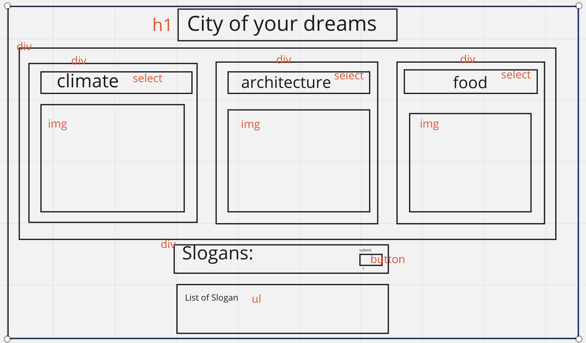

# CITY BUILDER !!!

## Elements

-   header
    -   h1
-   section (dropdown and img)

    -   div
        - select 
            - option 
            - option 
            - option
        - img
    -   div
        - select
            - option
            - option
            - option
        - img
    -   div
        - select 
            - option 
            - option 
            - option
        - img

-   section (slogan aggregator)
    - div 
        - input 
        - button
    - div 
        - ul 
            - input add li

## DOM Elements

- selectors
    - Climate
    - Architecture
    - Cuisine
- Img tags
    - climateImg
    - architectureImg
    - foodImg
- slogan section
    - input
    - button
    - list

## States

- Slogans Array

## Events

- change img to selector return value (x3)
- button on click push input into slogans array
    - create element li and deposit array input value

## Stretch Goals
- make pretty <3
- store input name of city
- Night mode Day mode button OR CYCLE !!!
- Background sounds !
- Display change history